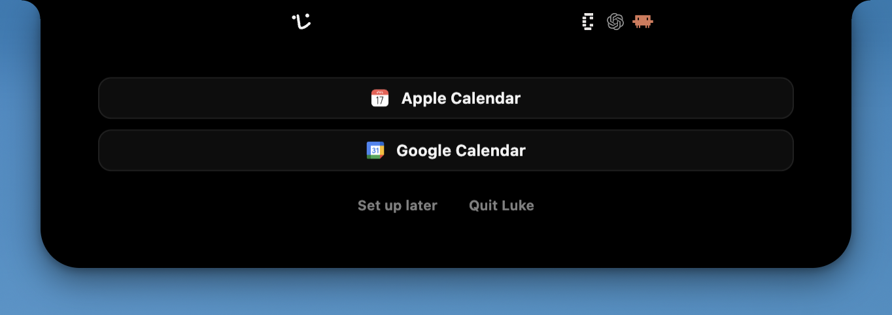
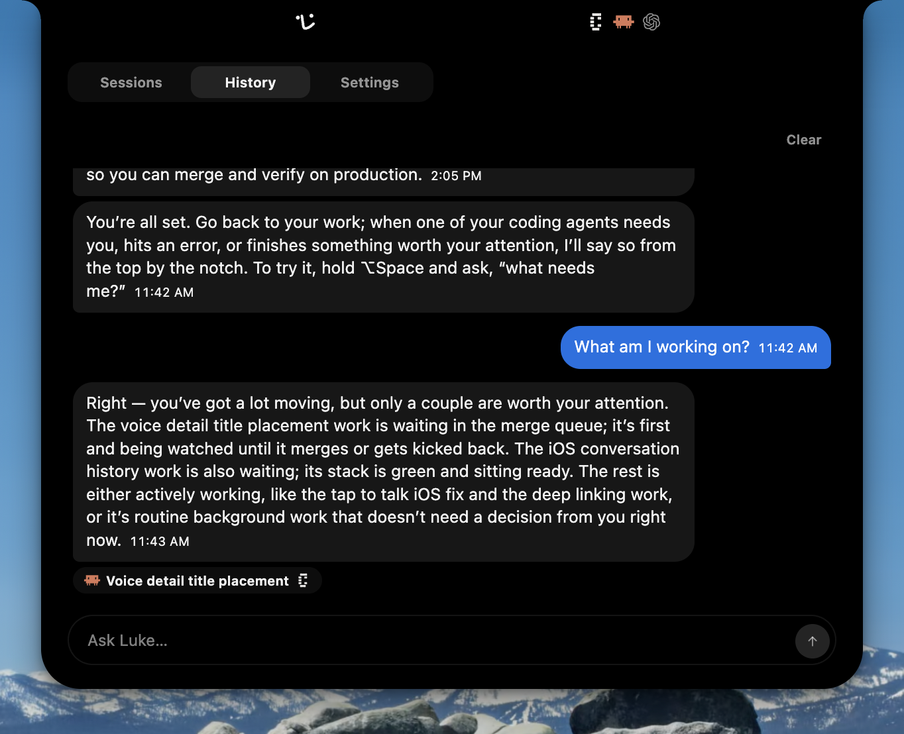

# Changelog

<!-- Every release adds its entry here before its tag is pushed:
     .github/RELEASE.md describes the step, and scripts/repository-checks.sh
     refuses a desktop version this file does not name. The landing page
     renders this document at tryluke.dev/changelog, and each release heading
     is a contract with that page: exactly `## <version> — <YYYY-MM-DD>`,
     which becomes the release's sticky version-and-date rail.

     Style: say what changed for the reader and stop. A big feature gets a
     `###` section of its own, named for the feature and described in a
     sentence or three, with a screenshot where one helps.
     Everything else gathers under the standing sections, in this order:
     `### Improvements` for what got better, `### Fixes` for what got repaired,
     `### Misc` for brand, packaging, documentation, and the like. A bullet is
     one sentence with no period at the end, leading with the thing itself
     rather than its background. Improvements and feature prose speak in the
     present tense to "you", with Luke as the actor; Fixes read
     "Fixed <symptom you could see>"; Misc reads "Added/Updated …". "Now" only
     where the old behavior is the contrast. Name features, pages, and
     shortcuts concretely. No pull request links: the release's own GitHub page
     carries the commits, and a trail of them in the prose is noise on a page
     for users.

     Screenshots live in apps/web/public/changelog/<version>/, each named for
     what it shows and placed under the section it illustrates, and are
     written here repository-relative
     (apps/web/public/changelog/<version>/<name>.png) so GitHub renders them
     too; the page rewrites that prefix to the site root. A release's
     screenshots are frozen with it: a UI change gets a new screenshot in the
     release that changed it, never an edit to an old one. A capture may show
     real sessions instead of fixture data, but mind what it carries: a title,
     branch, or conversation committed to history stays there, and whatever it
     reveals is published with it. -->

Notable changes to Luke, newest first. Each heading is a released version and
the date its release was published.

## 0.6.0 — 2026-09-15

### One brain, running on Luke's service

Luke's replies and announcements come from one brain that remembers across
turns, and it runs on his service rather than on your Mac. Once a minute the
service checks your Conductor sessions and wakes the brain with what changed,
so a session that finished or needs you is noticed whether or not your Mac is
awake. Ask about a session and he reads what it did, including the chat's own
conversation.

### Voice on your Luke account, and voice alone

Spoken exchanges need no OpenAI key of your own — every call runs through
Luke's service on the account you signed in with, so the Voice page loses its
Provider section and a key an earlier build stored is dropped at launch. Hold
the talk key and the microphone is open for exactly as long as you hold it;
release it and Luke keeps talking until the stop key or Escape. The Voice row
offers all 22 Live voices, with Marin as the default.

The Ask Luke composer, its ⌥L shortcut, and typed asks are gone.

### The Conversation tab

History is now Conversation, and it draws the account's one thread as the
service holds it, so a Clear on any device empties it everywhere. Luke's
replies render as Markdown, each action he took is a row saying what he did
with a chip that opens the session it reached, and several in one turn fold
under a line that counts them. An ellipsis beside each of his messages opens
thumbs up and down; a thumbs down offers a feedback composer with the message
quoted, and nothing leaves your Mac until you press Send.

### Luke's notebook

Luke keeps a notebook on the service: what he knows about you, the decisions
worth remembering, and a dated note for each day he works. Before answering
about prior work, dates, people, or preferences he searches it and reads only
the lines he needs. A read-only Memory page in Settings shows the notebook as
he wrote it.

### Your Conductor key lives in the vault

Connect on the Connections row stores your Conductor key in your account's
vault, never on your Mac, and a key an earlier build kept locally is handed
over once and deleted here. Onboarding asks for that key right after your
first sign-in, ahead of any session row and the calendar step.

### Improvements

- Luke greets you by first name at every signed-in launch, and the spoken
  introduction waits for your first sign-in instead of greeting a stranger
- Briefings are two short sentences at most, subject first, and never a title
  read aloud
- A voice call opens already knowing your roster, so "anything need me?" is
  answered without a round trip
- A reply that only needed a read is spoken the moment its words form, and
  Luke may read ahead to a session or a notebook search while you are still
  speaking
- Every spoken exchange is kept, including the ones Luke answers himself, so
  your words and his come back after a relaunch
- Captions show your own words as you say them, in a quieter tone, and every
  segment of a longer reply rolls up under the housing
- You can stop an ask: a Stop on a waiting ask is honored when its turn
  starts, and a Stop on a running one ends only the turn it was aimed at
- The Voice page's Pause announcements switch becomes Announce when sessions
  need you, on by default; switching it back on reads the still-true held ones
  out together
- A briefing on offer opens a muted session on your Mac so Luke speaks it here
  when you are present, and is pushed to your phone when you are not
- Pressing a filled thumb takes a rating back, and the message stands unrated
  on every device
- Luke reads an agent's messages whole instead of the first 400 characters,
  and walks a long Conductor chat to its end
- Luke's persona is a set of rules with a banned-phrase list rather than
  exemplars, so a day of announcements no longer hardens into stock phrases
- An action whose effect is uncertain after a crash shows as unknown in the
  Conversation, distinct from a refusal, and Luke never retries it on his own
- A Conductor workspace can be created with Fable 5.1 or GPT-6 Astra as its
  agent's model
- A settings search result lands the keyboard on the row's control rather than
  the page header
- The Conversation tab's Clear moves beside the tab bar and shows only while
  the thread has lines
- tryluke.dev prerenders the landing, About, Changelog, and Privacy pages, so
  link previews and visitors without JavaScript see the page

### Fixes

- Fixed a workspace created or an agent added through Luke going out with
  Conductor's default agent, model, and effort instead of the pairing you chose
- Fixed a voice chosen on the Voice page not taking until the standing call had
  idled out
- Fixed asking Luke to create a workspace in a Conductor cloud project being
  refused with "No listed project matches that identity"
- Fixed asking Luke to flip the Captions switch being refused with "Captions
  takes no effort level"
- Fixed clearing a setting answering "Could not save that setting on this
  system" and coming back at the next launch
- Fixed Mission Control tiling the notch panel in the middle of the desktop
  after an introduction takeover
- Fixed quitting Luke mid-meeting dropping the meeting hold on announcements
  until the next poll
- Fixed Luke saying "I couldn't write that ask down" for a follow-up asked
  seconds after a question
- Fixed a spoken ask's row landing one word short of what you said, and a
  spoken line vanishing from the Conversation two seconds after you finished
- Fixed a reply drawing above your question when a spoken ask entered a turn
  late, and an aside sorting up into a turn that had settled
- Fixed "Still thinking" dots drawing above later replies for an interrupted
  turn
- Fixed the feedback composer opened from a thumbs down returning to Settings
  instead of the Conversation
- Fixed an announcement's arrival line reading a session title from before the
  pass that named it
- Fixed the Conversation drawing Luke's reply twice, and what he said aloud
  drifting from the words it recorded
- Fixed a voice call ending at the provider's hour cap with a red
  "[object RTCErrorEvent]" caption; an idle call now retires itself after five
  minutes
- Fixed the key slot and feedback composer popups opening with empty black
  above their words on a Mac without a notch
- Fixed the lead provider mark hopping left and springing back as the capsule
  unfolded

### Misc

- Updated the provider set to Conductor alone: Superset, the local Claude Code,
  Codex, and OMP observers, and the Linear connection are removed
- Updated a live launch to remove the retired local brain database an earlier
  build left on your Mac
- Updated PRIVACY.md for the scheduled observation of your Conductor sessions,
  voice on the account alone, spoken exchanges kept on the service, the
  read-ahead a spoken ask may make, and the notebook's search
- Updated the landing page's footer to close on a "© 2026 Stage Inc." line
- Updated the third-party notice to name every OpenClaw port the code carries
- Updated the About page portraits to full-resolution JPEGs with their
  metadata stripped

## 0.5.0 — 2026-09-03

### Onboarding ends at a calendar

Onboarding now ends by asking for a calendar — your Mac's own or Google — so
meeting quiet can hold announcements from your first sign-in. Skip it and Luke
carries on without one.

### Improvements

- Announcements say what an agent is working on, a short phrase Luke derives
  from the session's transcript, instead of the session's title
- A Pause announcements switch on the Voice page holds spoken announcements by
  hand; replies in a conversation you opened still speak
- The Ask Luke composer also sits at the foot of the History tab, so you can
  continue the thread without changing tabs
- Luke names every workspace he creates — your name when you gave one,
  otherwise a short name for the work — instead of Conductor's random-city
  fallback

### Fixes

- Fixed History cutting off any ask or reply longer than 400 characters
- Fixed the Provider keys section reading "The vault answered with something
  unexpected" for a key stored for a provider Luke no longer carries
- Fixed the spoken introduction ending on a question you had no chance to
  answer

### Misc

- Updated the provider set to Conductor, Superset, Claude Code, Codex, and OMP,
  with Cursor, OpenCode, Copilot, Gemini CLI, and Grok Build staying on as the
  agents a workspace runs

## 0.4.0 — 2026-09-02

### Synced provider keys

Enter a cloud provider's API key once and every Mac you sign Luke into has it.
A Sync section in Settings governs it: while on, your account's vault holds
what this Mac's encrypted store holds, and turning it off deletes every synced
copy while the local keys stay. A key your shell configured is never synced —
only one you typed into Luke.

### A conversation that outlives the app

The History tab now survives a quit. The thread, and the facts you asked Luke
to remember, live in his own application data under a real retention policy —
the 200 most recent lines, nothing older than a fortnight — and Clear still
empties the file along with the screen. Lines draw as they are being said, each
carries its local timestamp, and every chat a line named draws a chip that
opens it, even after the chat is archived.

### Improvements

- Luke opens at login, a switch under Appearance backed by macOS's own login
  items
- Spoken exchanges run on the OpenAI Agents realtime SDK, which owns the
  connection, the session configuration, and the tool round-trips
- Several sessions changing at once arrive as one announcement instead of a run
  of them
- Luke observes local OMP sessions, reading their title, status, recap, current
  tool, and conversation
- A keyboard shortcut can be removed outright: the row says None, and Reset
  restores the default
- A session's parting words are shown whole on its row and its own screen
- Luke words his own announcements from the observed fields rather than reading
  a composed sentence
- Ask about "that chat" right after an announcement and Luke resolves it to the
  one he just told you about, naming the candidates when nothing settles it
- Spoken time is no longer metered: the hosted voice quota and the settings it
  needed are gone
- Every provider API key hint reads the same way and links to the page that
  issues the key

### Fixes

- Fixed the Updates row moving under your cursor while an update downloaded
- Fixed Luke silently losing the ability to lower and restore Music and
  Spotify, leaving an unkillable helper at full CPU
- Fixed the landing page drawing its footer hairline across the hero art on
  phones
- Fixed the landing page's hero mock spilling outside the phone's screen

### Misc

- Added Sentry crash reporting: unhandled exceptions from every Electron
  process and native minidumps, carrying no account identity
- Added the hosted `/api/observe` endpoint, which runs each cloud adapter once
  under the caller's vault keys and answers a bounded roster
- Added hosted act endpoints for messaging a session and creating a workspace
- Updated how Luke's persona instructions describe his voice

## 0.3.13 — 2026-08-28

### History

Luke keeps the conversation you have been having with him. A History tab holds
every line of the current launch — what you asked, what he answered, and the
acts he carried at your request — and each message offers a copy control that
takes exactly the words the bubble shows. Clear empties both the thread you can
see and the context the model still holds, and the whole tab stays out of
session recordings.

### Improvements

- The notch says which apps hold your work: provider marks take the place of
  the session count beside the housing
- Luke names each agent by its work and gives you the decision context before
  he asks a question
- Luke never asks for folder permission: Cursor and Antigravity sessions no
  longer read a workspace folder to label their branch
- Rows say when a session is running inside a Herdr pane
- Music and Spotify are asked for automation consent only mid-exchange, and
  only once that player is audibly playing
- Settings drop the Usage data section: counting and screen recording follow
  the run mode alone, and PRIVACY.md is the whole of what Luke tells you about
  either

### Fixes

- Fixed desktop session recordings never reaching PostHog at all
- Fixed a red voice error appearing when you cut Luke off mid-reply
- Fixed a slow cloud write being cut short by the observation pass's shared
  deadline
- Fixed the admin roster's last-seen instant ignoring hosted usage

### Misc

- Added the hosted provider-key vault, which encrypts a stored cloud provider
  key at rest and offers no way to read one back
- Added the websocket realtime endpoint to the voice mint
- Added the `entire` CLI's session hooks for Codex, Cursor, and OpenCode
- Updated an act handler's refusals to name their cause

## 0.3.12 — 2026-08-26

### Improvements

- Luke uses Echo as his default voice and gives you a short spoken welcome
  after sign-in
- Luke keeps his conversation context on the app guide and leaves the tracker's
  issue roster out of it
- Replicas workspaces can sleep when their task finishes, and Luke reports
  unexpected wakes as observation diagnostics
- Development traces capture Luke's local agent traffic and export attention
  reviews in the form the model received
- Onboarding stays out of the way while macOS asks for microphone access

### Fixes

- Fixed provider marks disappearing while Luke speaks
- Fixed update checks giving up while a newly published release is still
  uploading
- Fixed voice conversations reseeding history or changing roster context on
  clock ticks
- Fixed Conductor reads including archived workspaces or starting from an
  unfiltered workspace list
- Fixed GitHub releases becoming visible before all six downloadable assets
  finished uploading

### Misc

- Added an About page, a contact address, and maintainer credits
- Updated the hosted macOS release and Replicas lifecycle documentation
- Updated the product framing across the website and README

## 0.3.11 — 2026-08-25

### Improvements

- Luke opens Replicas sessions directly in the Replicas desktop app
- Luke keeps agent updates concise, specific to the work, and available after
  meeting quiet ends
- The admin dashboard makes account status, usage, and controls easier to scan

### Fixes

- Fixed first-launch announcements waiting for an interaction before they could
  be heard
- Fixed signed-in users who finished onboarding being offered the introduction
  again
- Fixed swallowed admin API failures omitting the upstream 503 cause from logs
- Fixed hosted macOS releases omitting the PostHog project key and silently
  disabling recording

## 0.3.10 — 2026-08-24

### Onboarding

Luke introduces himself to new users.

### Improvements

- Luke is more conversational and proactive about work that needs your
  attention
- Luke draws loading rows while a provider roster is temporarily unreadable
  instead of making those agents disappear
- The website demonstrates Luke's panel with a live mesh gradient and an
  animated tour of its presentations

### Fixes

- Fixed Preview deployments failing to complete sign-in
- Fixed workspace creation losing the provider selected in Settings
- Fixed the web service omitting the acts package from its runtime wiring
- Fixed signed-out voice runs reporting the wrong missing credential
- Fixed workspace-only providers being rejected by the desktop bridge
- Fixed Apple notarization uploads using the accelerated transfer path that
  could leave incomplete submissions stuck as In Progress

### Misc

- Updated the README and privacy policy for the current product behavior
- Updated the account connection pages and the internal animation reference

## 0.3.9 — 2026-08-23

### More agents, one roster

Luke observes local Antigravity, Grok Build, and Radius Browser agent chats,
alongside Replicas cloud workspaces connected with your own API key. He reads
each provider through its documented local or cloud surface, and providers
without credentials work as before.

### Improvements

- You can filter the roster by the app or provider behind each chat
- Luke can create Conductor workspaces and message the live Superset terminal
  attached to a chat
- Luke names, recaps, opens, and messages local Cursor chats through Cursor's
  own records and agent CLI
- Luke can check for updates or restart into a downloaded update when you ask

### Fixes

- Fixed archived cloud work continuing to appear in the roster
- Fixed Luke narrating tool calls and adding filler to spoken updates
- Fixed Luke inventing a recap segment when a session has no recap

### Misc

- Updated analytics sharing to include broader product events and unmasked
  session replay, with the recording control governing both
- Updated the workspace to pnpm 10

## 0.3.8 — 2026-08-20

### Improvements

- Luke uses Conductor's own chat names and opens each local chat directly

### Fixes

- Fixed panel content sitting flush against the strip instead of keeping a
  consistent inset
- Fixed macOS releases failing while electron-builder assembled the installer
  DMG

### Misc

- Updated the macOS release pipeline to use electron-builder alone
- Updated the README, privacy policy, contribution guide, and security policy
  for launch

## 0.3.7 — 2026-08-20

### Improvements

- Luke opens local Cursor chats through Cursor's own agent route

### Fixes

- Fixed Luke announcing that a chat is waiting when it does not need a reply
- Fixed the ready-to-install update status using unnecessary extra copy
- Fixed Developer ID releases omitting native helpers from the packaged app

## 0.3.6 — 2026-08-20

### Improvements

- An open spoken ask can name the app where its answer belongs

### Fixes

- Fixed Developer ID releases failing while signing the nested Calendar helper
- Fixed spoken announcements calling a settled chat "waiting on you" when it
  did not need a reply

## 0.3.5 — 2026-08-20

### Improvements

- Luke keeps your voice conversation history across calls, so you can continue
  where you left off
- Luke records your spoken turns alongside his replies in the conversation
  history
- Luke can search the session list when you ask out loud
- Superset workspaces without chats show as standing rows you can delete

### Fixes

- Fixed the session count appearing before the roster finished loading
- Fixed idle voice calls lingering after their conversation history took over

### Misc

- Updated every declared Node.js version to match the repository version

## 0.3.4 — 2026-08-20

### Improvements

- Luke reads your Mac's own calendars to stay quiet while you are in a meeting
- Luke observes local Gemini CLI sessions alongside your other coding agents
- Luke opens local Conductor chats at the exact place their notifications point
- Spoken announcement notices show each session's app marks
- Luke combines session filters in spoken asks just like the panel chips do

### Fixes

- Fixed voice replies ending early when audio resumes after draining
- Fixed the web service failing to load its function sources
- Fixed unanswered cloud writes appearing to have failed
- Fixed spoken announcements interrupting your active conversation
- Fixed spoken panel asks misunderstanding session filters and sort order
- Fixed status-edge announcements omitting the session name
- Fixed session-list asks bypassing the panel's session filter
- Fixed spoken session answers omitting the apps that hold each session
- Fixed media volume restoration being skipped when Luke quits

### Misc

- Added the electron-builder release path
- Updated the installer volume name to Luke Installer
- Updated the provider documentation around agents, apps, and read/write
  surfaces

## 0.3.3 — 2026-08-20

### Improvements

- Luke marks your sessions held by cmux and opens their exact pane
- Luke keeps your session filter choices across closings and restarts
- Luke groups your local Orca agents under their worktrees

### Fixes

- Fixed a stopped voice reply being trimmed past the end of its audio
- Fixed Spotify volume restoration being skipped when the app is installed in
  its current location

## 0.3.2 — 2026-08-20

### Improvements

- Session rows lead with the agent doing the work and show the apps holding
  each session

### Fixes

- Fixed automatic updates failing before a download could begin
- Fixed the Superset sign-in popup looking unlike Luke's other credential
  prompts

### Misc

- Added Luke's icon to the mounted installer volume
- Updated the design contract and package boundaries

## 0.3.1 — 2026-08-19

### Fixes

- Fixed Luke falling asleep at launch before the first session roster arrived

## 0.3.0 — 2026-08-19

### Superset workspaces

Luke connects to Superset and puts its managed workspaces alongside every other
coding-agent session. You can create, open, rename, message, and delete settled
workspaces without leaving Luke.

### Improvements

- You can search Settings
- Luke keeps himself current from the Updates row
- Luke stays silent for sessions waiting on automation
- Luke hides archived Claude Code and local Codex sessions
- Luke's voice and interface speak more directly about agents and their work
- Settings makes a spent free voice allowance clear everywhere

### Fixes

- Fixed a typed ask requesting microphone permission
- Fixed the panel closing when its shape receded past the pointer
- Fixed delegated Codex chat titles and announcements
- Fixed voice stop cancellation races
- Fixed the Superset sign-in code field looking unlike the other key slots

### Misc

- Added PostHog analytics setup
- Added anti-slop Oxlint rules across the repository

## 0.2.0 — 2026-08-18

### Usage data

Luke counts how his own features are used — a launch, a provider connected,
sessions observed, a call opened — and sends those counts to his own service,
tied to your account, so we can see what is worth building next. It is on by
default, and the switch is Share usage data in the new Usage data section on
the Settings tab's front page. Every event name and value is fixed by the
build, so nothing about a session and nothing you type or say can travel in
one, and nothing is sent while you are signed out. [Privacy](PRIVACY.md) lists
every event and property by name.

### Codex cloud tasks

Luke observes your Codex cloud tasks through the Codex CLI.

### Previews you can press

Linear issues show as chips under the notch.

### Improvements

- Luke's role is an engineering manager
- Session rows show the number of files touched and lines changed when
  available
- Luke observes local Devin CLI sessions
- Linear connects through a Luke Linear app instead of an API key
- Luke hears what you say while the call is still connecting, even on the first
  press after launch
- Meeting quiet starts and ends on the meeting's own instants, and holds
  through a calendar misread
- A bare "new agent" ask opens a new workspace
- An agent's pull request button uses the PR number

### Fixes

- Fixed completion notices firing as sessions closed
- Fixed announcements colliding with a reply Luke was still speaking
- Fixed back-to-back replies sharing one caption
- Fixed captions overlapping the volume hint, re-wrapping mid-display, and
  vanishing under a resting pointer

### Misc

- Added link card previews everywhere
- Updated the landing page with a direct download button
- Removed the menu bar item
- Removed excessive panel animations

## 0.1.1 — 2026-08-17

### Free daily allowance

Luke's voice runs on an included daily allowance, or you can connect your own
OpenAI key.

### Google Calendar

Luke reads when your meetings start and end, and holds his updates until the
meeting is over.

### Improvements

- Luke checks for updates on his own
- Announcements join a conversation you already have open, with a clickable
  chip that jumps to the session
- Every Settings page marks changed rows and offers a reset to defaults
- You can delete your Luke account from Settings
- Luke can set a Conductor session's model and effort in one move
- Signing in is smoother, from first launch to the finished account
- The archive control moves to the workspace tray header, and the microphone
  permission to the Voice page

### Fixes

- Fixed Luke repeating himself across back-to-back replies
- Fixed the microphone staying open after an exchange ended
- Fixed archived Conductor workspaces still appearing in the list
- Fixed captions scrolling too fast to read
- Fixed Claude Code sessions showing the wrong time
- Fixed Luke misunderstanding questions about all your sessions at once

### Misc

- Added logo and mark variations
- Updated the landing page download button to always fetch the latest build

## 0.1.0 — 2026-08-16

Introducing Luke: a voice agent that lives in the MacBook notch and watches
every local and cloud coding agent session.

### One panel for every agent

One panel shows every coding agent working for you: Claude Code, Codex, Cursor,
and OpenCode on your Mac, and Conductor, Cursor, Devin, Google Jules, and
GitHub Copilot in the cloud. Filter, sort, or search the list, and click a
session to open it where it runs.

### Talk to Luke

Hold <kbd>⌥</kbd><kbd>S</kbd> to speak with Luke, or press
<kbd>⌥</kbd><kbd>L</kbd> to type to him from any app. He answers about
sessions, changes his own settings, opens sessions, messages agents, creates
workspaces and spawns agents, and reads and acts on Linear issues.

### Announcements

Luke speaks up when a session starts waiting, hits an error, or finishes. He
can show captions on screen, turn down Music and Spotify while he talks, and
display a clickable chip naming the session.

### Misc

- Added hook observation for Claude Code and Codex, so Luke can tell a finished
  turn from one you walked away from
- Added Luke's face to the menu bar and the notch
- Added settings for showing Luke in the menu bar and Dock, the display he sits
  on, his voice and pace, and editable shortcuts
- Added a form to send the founders feedback or submit a prompt
- Added sign-in with Google or GitHub
