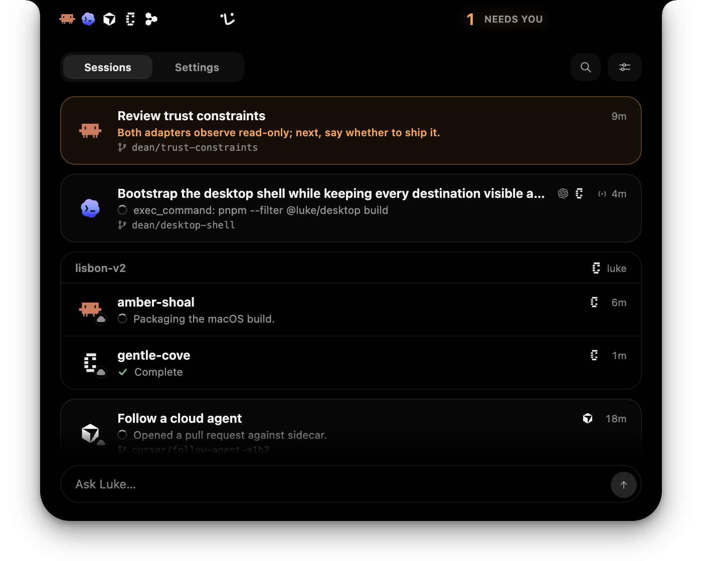
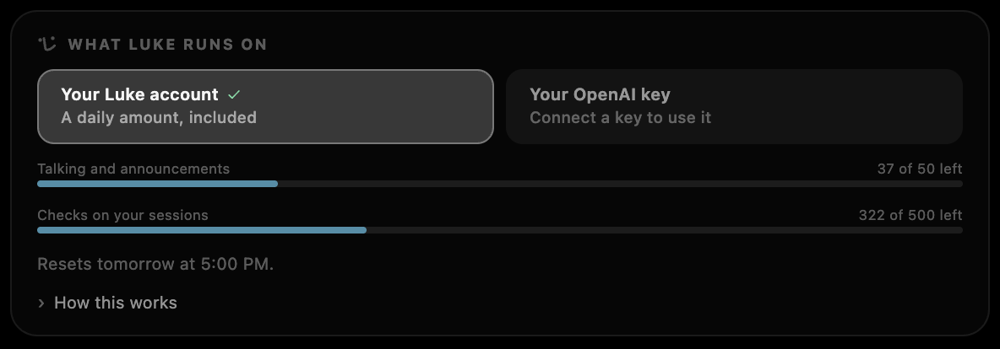
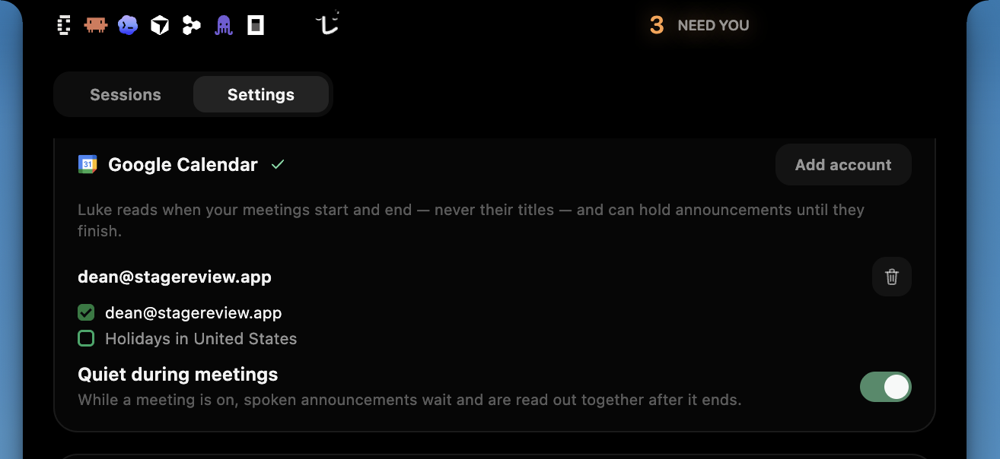
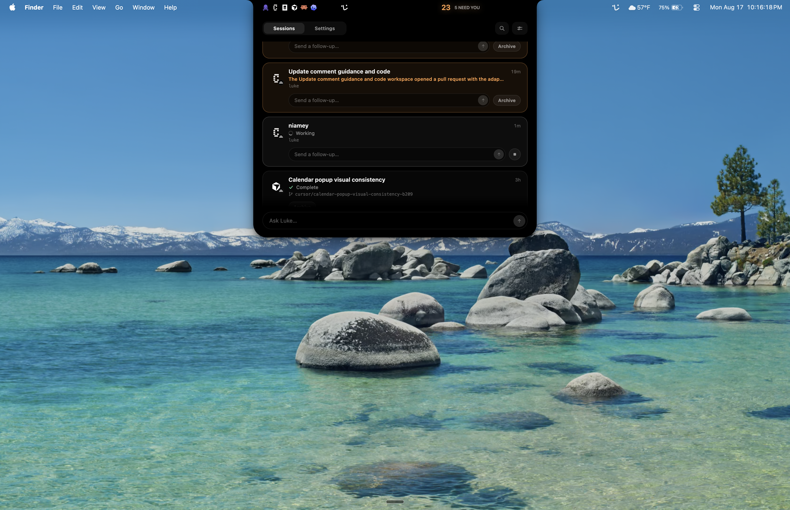

# Changelog

<!-- Every release adds its entry here before its tag is pushed:
     .github/RELEASE.md describes the step, and scripts/repository-checks.sh
     refuses a desktop version this file does not name. The landing page
     renders this document at tryluke.dev/changelog, and each release heading
     is a contract with that page: exactly `## <version> — <YYYY-MM-DD>`, which
     becomes the release's sticky version-and-date rail. Inside a release, a
     big feature gets a `###` section of its own, named for the feature and
     described in prose, with a screenshot where one helps. Everything else
     gathers under the three standing sections, in this order: `### Improvements`
     for what got better, `### Fixes` for what got repaired, and
     `### Miscellaneous` for what fits neither: brand, packaging, and the
     like. A standing section's bullets are each one sentence with no period
     at the end. One voice per section: feature prose and Improvements speak
     in the present tense to "you", with Luke as the actor; Fixes each read
     "Fixed <symptom you could see>"; Miscellaneous bullets read
     "Added/Updated …". "Now" only where the old behavior is the contrast;
     a new capability speaks in plain present tense. Name things concretely
     and lead with the benefit. Link pull requests where relevant.
     Screenshots live in apps/web/public/changelog/<version>/, one file per
     `###` section named by the section heading's kebab-case slug (a second
     image for a section keeps the slug as its prefix), and are written here
     repository-relative (apps/web/public/changelog/<version>/<slug>.png) so
     GitHub renders them too; the page rewrites that prefix to the site root.
     A release's screenshots are frozen with it. They show what shipped, so
     a UI change gets a new screenshot in the release that changed it, never
     an edit to an old one, and every capture uses fixture data
     (./scripts/run.sh --fixture smoke), because a real session's title or
     branch committed to history stays there. -->

Notable changes to Luke, newest first. Each heading is a released version and
the date its release was published.

## 0.3.11 — 2026-08-25

### Improvements

- Luke opens Replicas sessions directly in the Replicas desktop app
  ([#516](https://github.com/ReviewStage/luke/pull/516))
- Luke keeps agent updates concise, specific to the work, and available after
  meeting quiet ends
  ([#514](https://github.com/ReviewStage/luke/pull/514),
  [#515](https://github.com/ReviewStage/luke/pull/515))
- The admin dashboard makes account status, usage, and controls easier to scan
  ([#511](https://github.com/ReviewStage/luke/pull/511))

### Fixes

- Fixed first-launch announcements waiting for an interaction before they
  could be heard ([#477](https://github.com/ReviewStage/luke/pull/477))
- Fixed signed-in users who finished onboarding being offered the introduction
  again ([#512](https://github.com/ReviewStage/luke/pull/512))
- Fixed swallowed admin API failures omitting the upstream 503 cause from logs
  ([#492](https://github.com/ReviewStage/luke/pull/492))
- Fixed hosted macOS releases omitting the PostHog project key and silently
  disabling recording

### Miscellaneous

- Updated the 0.3.10 onboarding notes with its release screenshot
  ([#510](https://github.com/ReviewStage/luke/pull/510))

## 0.3.10 — 2026-08-24

### Onboarding

Luke introduces himself to new users.
([#497](https://github.com/ReviewStage/luke/pull/497),
[#508](https://github.com/ReviewStage/luke/pull/508))

### Improvements

- Luke is more conversational and proactive about work that needs your
  attention ([#500](https://github.com/ReviewStage/luke/pull/500))
- Luke draws loading rows while a provider roster is temporarily unreadable
  instead of making those agents disappear
  ([#498](https://github.com/ReviewStage/luke/pull/498))
- The website demonstrates Luke's panel with a live mesh gradient and an
  animated tour of its presentations
  ([#499](https://github.com/ReviewStage/luke/pull/499),
  [#502](https://github.com/ReviewStage/luke/pull/502),
  [#504](https://github.com/ReviewStage/luke/pull/504))

### Fixes

- Fixed Preview deployments failing to complete sign-in
  ([#408](https://github.com/ReviewStage/luke/pull/408))
- Fixed workspace creation losing the provider selected in Settings
  ([#475](https://github.com/ReviewStage/luke/pull/475))
- Fixed the web service omitting the acts package from its runtime wiring
  ([#495](https://github.com/ReviewStage/luke/pull/495))
- Fixed signed-out voice runs reporting the wrong missing credential
  ([#505](https://github.com/ReviewStage/luke/pull/505))
- Fixed workspace-only providers being rejected by the desktop bridge
  ([#507](https://github.com/ReviewStage/luke/pull/507))
- Fixed Apple notarization uploads using the accelerated transfer path that
  could leave incomplete submissions stuck as In Progress

### Miscellaneous

- Updated the README and privacy policy for the current product behavior
  ([#474](https://github.com/ReviewStage/luke/pull/474),
  [#476](https://github.com/ReviewStage/luke/pull/476))
- Updated the account connection pages and the internal animation reference
  ([#488](https://github.com/ReviewStage/luke/pull/488),
  [#501](https://github.com/ReviewStage/luke/pull/501))

## 0.3.9 — 2026-08-23

### More agents, one roster

Luke observes local Antigravity, Grok Build, and Radius Browser agent chats,
alongside Replicas cloud workspaces connected with your own API key. He reads
each provider through its documented local or cloud surface while keeping
providers without credentials working as before.

### Improvements

- Luke lets you filter the roster by the app or provider behind each chat
  ([#455](https://github.com/ReviewStage/luke/pull/455))
- Luke can create Conductor workspaces and message the live Superset terminal
  attached to a chat
  ([#392](https://github.com/ReviewStage/luke/pull/392),
  [#450](https://github.com/ReviewStage/luke/pull/450))
- Luke names, recaps, opens, and messages local Cursor chats through Cursor's
  own records and agent CLI
  ([#383](https://github.com/ReviewStage/luke/pull/383),
  [#387](https://github.com/ReviewStage/luke/pull/387),
  [#390](https://github.com/ReviewStage/luke/pull/390),
  [#400](https://github.com/ReviewStage/luke/pull/400))
- Luke can check for updates or restart into a downloaded update when you ask
  ([#388](https://github.com/ReviewStage/luke/pull/388))

### Fixes

- Fixed archived cloud work continuing to appear in the roster
  ([#385](https://github.com/ReviewStage/luke/pull/385),
  [#427](https://github.com/ReviewStage/luke/pull/427))
- Fixed Luke narrating tool calls and adding filler to spoken updates
  ([#451](https://github.com/ReviewStage/luke/pull/451),
  [#470](https://github.com/ReviewStage/luke/pull/470))
- Fixed Luke inventing a recap segment when a session has no recap
  ([#469](https://github.com/ReviewStage/luke/pull/469))

### Miscellaneous

- Updated analytics sharing to include broader product events and unmasked
  session replay, with the recording control governing both
  ([#409](https://github.com/ReviewStage/luke/pull/409))
- Updated the workspace to pnpm 10
  ([#449](https://github.com/ReviewStage/luke/pull/449))

## 0.3.8 — 2026-08-20

### Improvements

- Luke uses Conductor's own chat names and opens each local chat directly
  ([#362](https://github.com/ReviewStage/luke/pull/362))

### Fixes

- Fixed panel content sitting flush against the strip instead of keeping a
  consistent inset ([#377](https://github.com/ReviewStage/luke/pull/377))
- Fixed macOS releases failing while electron-builder assembled the installer
  DMG ([#380](https://github.com/ReviewStage/luke/pull/380))

### Miscellaneous

- Updated the macOS release pipeline to use electron-builder alone
  ([#367](https://github.com/ReviewStage/luke/pull/367))
- Updated the README, privacy policy, contribution guide, and security policy
  for launch ([#379](https://github.com/ReviewStage/luke/pull/379))

## 0.3.7 — 2026-08-20

### Improvements

- Luke opens local Cursor chats through Cursor's own agent route
  ([#363](https://github.com/ReviewStage/luke/pull/363))

### Fixes

- Fixed Luke announcing that a chat is waiting when it does not need a reply
  ([#374](https://github.com/ReviewStage/luke/pull/374))
- Fixed the ready-to-install update status using unnecessary extra copy
  ([#373](https://github.com/ReviewStage/luke/pull/373))
- Fixed Developer ID releases omitting native helpers from the packaged app
  ([#375](https://github.com/ReviewStage/luke/pull/375))

## 0.3.6 — 2026-08-20

### Improvements

- Luke lets an open spoken ask name the app where its answer belongs
  ([#369](https://github.com/ReviewStage/luke/pull/369))

### Fixes

- Fixed Developer ID releases failing while signing the nested Calendar helper
  ([#370](https://github.com/ReviewStage/luke/pull/370))
- Fixed spoken announcements calling a settled chat "waiting on you" when it
  did not need a reply
  ([#374](https://github.com/ReviewStage/luke/pull/374))

## 0.3.5 — 2026-08-20

### Improvements

- Luke keeps your voice conversation history across calls so you can continue
  where you left off
  ([#354](https://github.com/ReviewStage/luke/pull/354))
- Luke records your spoken turns alongside his replies in the conversation
  history
  ([#355](https://github.com/ReviewStage/luke/pull/355))
- Luke can search the session list when you ask out loud
  ([#364](https://github.com/ReviewStage/luke/pull/364))
- Luke shows Superset workspaces without chats as standing rows you can delete
  ([#365](https://github.com/ReviewStage/luke/pull/365))

### Fixes

- Fixed the session count appearing before the roster finished loading
  ([#361](https://github.com/ReviewStage/luke/pull/361))
- Fixed idle voice calls lingering after their conversation history took over
  ([#356](https://github.com/ReviewStage/luke/pull/356))

### Miscellaneous

- Updated every declared Node.js version to match the repository version
  ([#366](https://github.com/ReviewStage/luke/pull/366))

## 0.3.4 — 2026-08-20

### Improvements

- Luke reads this Mac's own calendars to stay quiet while you are in a meeting
  ([#311](https://github.com/ReviewStage/luke/pull/311))
- Luke observes local Gemini CLI sessions alongside your other coding agents
  ([#347](https://github.com/ReviewStage/luke/pull/347))
- Luke opens local Conductor chats at the exact place their notifications point
  ([#349](https://github.com/ReviewStage/luke/pull/349))
- Luke shows each session's app marks on spoken announcement notices
  ([#340](https://github.com/ReviewStage/luke/pull/340))
- Luke combines session filters in spoken asks just like the panel chips do
  ([#348](https://github.com/ReviewStage/luke/pull/348))

### Fixes

- Fixed voice replies ending early when audio resumes after draining
  ([#342](https://github.com/ReviewStage/luke/pull/342))
- Fixed the web service failing to load its function sources
  ([#343](https://github.com/ReviewStage/luke/pull/343))
- Fixed unanswered cloud writes appearing to have failed
  ([#345](https://github.com/ReviewStage/luke/pull/345))
- Fixed spoken announcements interrupting the developer's active conversation
  ([#344](https://github.com/ReviewStage/luke/pull/344))
- Fixed spoken panel asks misunderstanding session filters and sort order
  ([#346](https://github.com/ReviewStage/luke/pull/346))
- Fixed status-edge announcements omitting the session name
  ([#350](https://github.com/ReviewStage/luke/pull/350))
- Fixed session-list asks bypassing the panel's session filter
  ([#351](https://github.com/ReviewStage/luke/pull/351))
- Fixed spoken session answers omitting the apps that hold each session
  ([#352](https://github.com/ReviewStage/luke/pull/352))
- Fixed media volume restoration being skipped when Luke quits
  ([#353](https://github.com/ReviewStage/luke/pull/353))

### Miscellaneous

- Added the electron-builder release path
  ([#324](https://github.com/ReviewStage/luke/pull/324))
- Updated the installer volume name to Luke Installer
  ([#339](https://github.com/ReviewStage/luke/pull/339))
- Updated the provider documentation around agents, apps, and read/write surfaces
  ([#341](https://github.com/ReviewStage/luke/pull/341))

## 0.3.3 — 2026-08-20

### Improvements

- Luke marks your sessions held by cmux and opens their exact pane
  ([#332](https://github.com/ReviewStage/luke/pull/332))
- Luke keeps your session filter choices across closings and restarts
  ([#336](https://github.com/ReviewStage/luke/pull/336))
- Luke groups your local Orca agents under their worktrees
  ([#333](https://github.com/ReviewStage/luke/pull/333))

### Fixes

- Fixed a stopped voice reply being trimmed past the end of its audio
  ([#335](https://github.com/ReviewStage/luke/pull/335))
- Fixed Spotify volume restoration being skipped when the app is installed in
  its current location ([#329](https://github.com/ReviewStage/luke/pull/329))

## 0.3.2 — 2026-08-20

### Improvements

- Session rows lead with the agent doing the work and show the apps holding
  each session ([#331](https://github.com/ReviewStage/luke/pull/331))

### Fixes

- Fixed automatic updates failing before a download could begin
  ([#327](https://github.com/ReviewStage/luke/pull/327))
- Fixed the Superset sign-in popup looking unlike Luke's other credential
  prompts ([#322](https://github.com/ReviewStage/luke/pull/322))

### Miscellaneous

- Added Luke's icon to the mounted installer volume
  ([#326](https://github.com/ReviewStage/luke/pull/326))
- Updated the design contract and package boundaries
  ([#328](https://github.com/ReviewStage/luke/pull/328),
  [#321](https://github.com/ReviewStage/luke/pull/321))

## 0.3.1 — 2026-08-19

### Fixes

- Fixed Luke falling asleep at launch before the first session roster arrived
  ([#319](https://github.com/ReviewStage/luke/pull/319))

## 0.3.0 — 2026-08-19

### Superset workspaces

Luke connects to Superset and puts its managed workspaces alongside every
other coding-agent session. You can create, open, rename, message, and delete
settled workspaces without leaving Luke.
([#274](https://github.com/ReviewStage/luke/pull/274),
[#299](https://github.com/ReviewStage/luke/pull/299),
[#309](https://github.com/ReviewStage/luke/pull/309),
[#310](https://github.com/ReviewStage/luke/pull/310),
[#312](https://github.com/ReviewStage/luke/pull/312),
[#316](https://github.com/ReviewStage/luke/pull/316))

### Improvements

- You can search Settings
  ([#305](https://github.com/ReviewStage/luke/pull/305))
- Luke keeps himself current from the Updates row
  ([#284](https://github.com/ReviewStage/luke/pull/284))
- Luke stays silent for sessions waiting on automation
  ([#298](https://github.com/ReviewStage/luke/pull/298))
- Luke hides archived Claude Code and local Codex sessions
  ([#295](https://github.com/ReviewStage/luke/pull/295),
  [#297](https://github.com/ReviewStage/luke/pull/297))
- Luke's voice and interface speak more directly about agents and their work
  ([#290](https://github.com/ReviewStage/luke/pull/290),
  [#296](https://github.com/ReviewStage/luke/pull/296),
  [#307](https://github.com/ReviewStage/luke/pull/307),
  [#313](https://github.com/ReviewStage/luke/pull/313))
- Settings makes a spent free voice allowance clear everywhere
  ([#308](https://github.com/ReviewStage/luke/pull/308))

### Fixes

- Fixed a typed ask requesting microphone permission
  ([#294](https://github.com/ReviewStage/luke/pull/294))
- Fixed the panel closing when its shape receded past the pointer
  ([#293](https://github.com/ReviewStage/luke/pull/293))
- Fixed delegated Codex chat titles and announcements
  ([#303](https://github.com/ReviewStage/luke/pull/303),
  [#304](https://github.com/ReviewStage/luke/pull/304),
  [#306](https://github.com/ReviewStage/luke/pull/306))
- Fixed voice stop cancellation races
  ([#315](https://github.com/ReviewStage/luke/pull/315))
- Fixed the Superset sign-in code field looking unlike the other key slots
  ([#317](https://github.com/ReviewStage/luke/pull/317))

### Miscellaneous

- Added PostHog analytics setup
  ([#289](https://github.com/ReviewStage/luke/pull/289))
- Added anti-slop Oxlint rules across the repository
  ([#286](https://github.com/ReviewStage/luke/pull/286))

## 0.2.0 — 2026-08-18

### Codex cloud tasks

Luke observes your Codex cloud tasks through the Codex CLI.
([#256](https://github.com/ReviewStage/luke/pull/256),
[#258](https://github.com/ReviewStage/luke/pull/258))

### Previews you can press

Linear issues show as chips under the notch.
([#250](https://github.com/ReviewStage/luke/pull/250),
[#257](https://github.com/ReviewStage/luke/pull/257),
[#271](https://github.com/ReviewStage/luke/pull/271))

### Usage data

Luke now counts how his own features are used (a launch, a provider connected,
sessions observed, a call opened) and sends those counts to Luke's own service,
tied to your account, so we can see what is worth building next. This is on by default, and the
switch is Share usage data in the new Usage data section on the Settings tab's
front page; turning it off stops it at once. Every event name and every value
is fixed by the build, so nothing about a session (no title, branch, path,
recap, or transcript) and nothing you type or say can travel in one, and
nothing is sent while you are signed out. [Privacy](PRIVACY.md) lists every
event and property by name.

### Improvements

- Luke counts how his own features are used, on by default and switched off
  under Share usage data on the Settings tab's front page
- Luke's role is an engineering manager
  ([#265](https://github.com/ReviewStage/luke/pull/265))
- Session rows show number of files touched and lines changed when available
  ([#260](https://github.com/ReviewStage/luke/pull/260))
- Luke observes local Devin CLI sessions
  ([#255](https://github.com/ReviewStage/luke/pull/255))
- Linear now connects via a Luke Linear app instead of an API key
  ([#261](https://github.com/ReviewStage/luke/pull/261))
- Luke hears what you say while the call is still connecting, even on the
  first press after launch
  ([#220](https://github.com/ReviewStage/luke/pull/220))
- The meeting quiet now starts and ends on the meeting's own instants, and
  holds through a calendar misread
  ([#270](https://github.com/ReviewStage/luke/pull/270),
  [#272](https://github.com/ReviewStage/luke/pull/272))
- A bare "new agent" ask opens a new workspace
  ([#230](https://github.com/ReviewStage/luke/pull/230))
- An agent's pull request button uses the PR number
  ([#249](https://github.com/ReviewStage/luke/pull/249))

### Fixes

- Fixed completion notices firing as sessions closed
  ([#246](https://github.com/ReviewStage/luke/pull/246))
- Fixed announcements colliding with a reply Luke was still speaking
  ([#231](https://github.com/ReviewStage/luke/pull/231))
- Fixed back-to-back replies sharing one caption
  ([#237](https://github.com/ReviewStage/luke/pull/237))
- Fixed captions overlapping the volume hint, re-wrapping mid-display, and
  vanishing under a resting pointer
  ([#248](https://github.com/ReviewStage/luke/pull/248),
  [#245](https://github.com/ReviewStage/luke/pull/245),
  [#262](https://github.com/ReviewStage/luke/pull/262))

### Miscellaneous

- Updated the landing page with a direct download button
  ([#221](https://github.com/ReviewStage/luke/pull/221))
- Added the link card previews everywhere
  ([#244](https://github.com/ReviewStage/luke/pull/244),
  [#273](https://github.com/ReviewStage/luke/pull/273))
- Removed the menu bar item
  ([#242](https://github.com/ReviewStage/luke/pull/242))
- Removed excessive panel animations
  ([#243](https://github.com/ReviewStage/luke/pull/243))

## 0.1.1 — 2026-08-17

### Free daily allowance

Luke's voice runs on an included daily allowance. Or you can connect your own
OpenAI key.
([#182](https://github.com/ReviewStage/luke/pull/182),
[#204](https://github.com/ReviewStage/luke/pull/204),
[#216](https://github.com/ReviewStage/luke/pull/216))

### Google Calendar

Luke reads when your meetings start and end and holds his updates until the
meeting is over.
([#195](https://github.com/ReviewStage/luke/pull/195))

### Improvements

- Luke checks for updates on his own
  ([#186](https://github.com/ReviewStage/luke/pull/186))
- Announcements now join a conversation you already have open, with a
  clickable chip that jumps to the session
  ([#180](https://github.com/ReviewStage/luke/pull/180),
  [#184](https://github.com/ReviewStage/luke/pull/184))
- Every Settings page marks changed rows and offers a reset to defaults
  ([#192](https://github.com/ReviewStage/luke/pull/192))
- You can delete your Luke account from Settings
  ([#222](https://github.com/ReviewStage/luke/pull/222))
- Luke can set a Conductor session's model and effort in one move
  ([#228](https://github.com/ReviewStage/luke/pull/228))
- Signing in is smoother, from first launch to the finished account
  ([#190](https://github.com/ReviewStage/luke/pull/190))
- The archive control now lives on the workspace tray header, and the
  microphone permission on the Voice page
  ([#219](https://github.com/ReviewStage/luke/pull/219),
  [#200](https://github.com/ReviewStage/luke/pull/200))

### Fixes

- Fixed Luke repeating himself across back-to-back replies
  ([#227](https://github.com/ReviewStage/luke/pull/227))
- Fixed the microphone staying open after an exchange ended
  ([#210](https://github.com/ReviewStage/luke/pull/210))
- Fixed archived Conductor workspaces still appearing in the list
  ([#198](https://github.com/ReviewStage/luke/pull/198))
- Fixed captions scrolling too fast to read
  ([#201](https://github.com/ReviewStage/luke/pull/201))
- Fixed Claude Code sessions showing the wrong time
  ([#208](https://github.com/ReviewStage/luke/pull/208))
- Fixed Luke misunderstanding questions about all your sessions at once
  ([#213](https://github.com/ReviewStage/luke/pull/213))

### Miscellaneous

- Added logo and mark variations
  ([#191](https://github.com/ReviewStage/luke/pull/191),
  [#196](https://github.com/ReviewStage/luke/pull/196))
- Updated the landing page download button to always fetch the latest build
  ([#183](https://github.com/ReviewStage/luke/pull/183))

## 0.1.0 — 2026-08-16

Introducing Luke: a voice agent that lives in the MacBook notch and
watches every local and cloud coding agent session.

### One panel for every agent

One panel shows every coding agent working for you: Claude Code, Codex,
Cursor, and OpenCode on your Mac, and Conductor, Cursor, Devin, Google Jules,
and GitHub Copilot in the cloud. Filter, sort, or search the list, and click a
session to open it where it runs.
([#18](https://github.com/ReviewStage/luke/pull/18),
[#27](https://github.com/ReviewStage/luke/pull/27),
[#59](https://github.com/ReviewStage/luke/pull/59),
[#166](https://github.com/ReviewStage/luke/pull/166))

### Talk to Luke

Hold <kbd>⌥</kbd><kbd>S</kbd> to speak with Luke, or press <kbd>⌥</kbd><kbd>L</kbd>
to type to him from any app. He answers about sessions, changes his own
settings, opens sessions, messages agents, creates workspaces and spawns
agents, and reads and acts on Linear issues.
([#12](https://github.com/ReviewStage/luke/pull/12),
[#78](https://github.com/ReviewStage/luke/pull/78),
[#70](https://github.com/ReviewStage/luke/pull/70),
[#89](https://github.com/ReviewStage/luke/pull/89))

### Announcements

Luke speaks up when a session starts waiting, hits an error, or finishes. He can show
captions on screen, turn down Music and Spotify while he talks, and display a clickable
chip naming the session. Ask him to "tell me when this session finishes" and he will.
([#97](https://github.com/ReviewStage/luke/pull/97),
[#149](https://github.com/ReviewStage/luke/pull/149),
[#173](https://github.com/ReviewStage/luke/pull/173))

### Miscellaneous

- Added hook observation for Claude Code and Codex, so Luke can tell a
  finished turn from one you walked away from
  ([#119](https://github.com/ReviewStage/luke/pull/119),
  [#169](https://github.com/ReviewStage/luke/pull/169))
- Added Luke's face to the menu bar and the notch
  ([#35](https://github.com/ReviewStage/luke/pull/35),
  [#51](https://github.com/ReviewStage/luke/pull/51))
- Added settings for showing Luke in the menu bar and Dock, the display he
  sits on, his voice and pace, and editable shortcuts
- Added a form to send the founders feedback or submit a prompt
  ([#87](https://github.com/ReviewStage/luke/pull/87))
- Added sign-in with Google or GitHub
  ([#161](https://github.com/ReviewStage/luke/pull/161))
