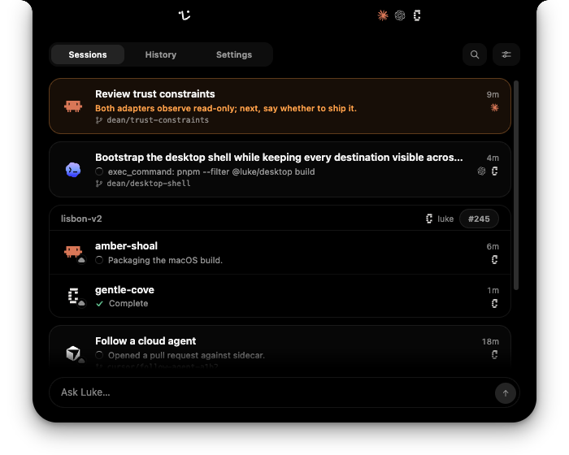
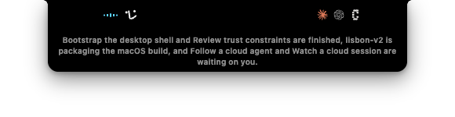

<p align="center">
  <picture>
    <source media="(prefers-color-scheme: dark)" srcset="design/brand/luke-wordmark-dark.svg">
    
  </picture>
</p>

<p align="center">
  <a href="https://github.com/ReviewStage/luke/actions/workflows/ci.yml"></a>
  <a href="https://github.com/ReviewStage/luke/releases/latest"></a>
  <a href="LICENSE"></a>
  
</p>

<p align="center">
  <strong>Your AI engineering manager.</strong><br>
  A macOS app that watches your coding agents and keeps you updated.
</p>

<p align="center">
  <a href="https://github.com/ReviewStage/luke/releases/latest/download/Luke.dmg"><picture><source media="(prefers-color-scheme: dark)" srcset="design/brand/button/luke-cta-download-dark.svg"></picture></a>
</p>

<p align="center">
  <a href="https://tryluke.dev">Website</a> ·
  <a href="PRIVACY.md">Privacy</a> ·
  <a href="CHANGELOG.md">Changelog</a>
</p>



## Features

### One panel for every agent

One panel shows every coding agent working for you: Antigravity, Claude Code,
Codex, Cursor, Gemini CLI, Grok Build, OpenCode, and Radius on your Mac, and
Codex, Conductor, Cursor, Devin, GitHub Copilot, Jules, and Replicas in the
cloud. Filter, sort, or search the list, and click a session to open it where
it runs.

### Talk to Luke

Hold <kbd>⌥</kbd><kbd>Space</kbd> to talk to Luke from any app, or press
<kbd>⌥</kbd><kbd>L</kbd> to type to him instead. He answers about your
sessions, opens them, messages agents, creates workspaces, changes his own
settings, and reads and acts on Linear issues. <kbd>⌥</kbd><kbd>S</kbd> stops
him talking. Voice runs on an included daily allowance, or your own OpenAI key.



### Announcements

Luke speaks up when a session starts waiting, hits an error, or finishes. He
shows captions on screen, turns down Music and Spotify while he talks, and
names the session in a chip you can press. Ask him to "tell me when this
session finishes" and he will.

### Quiet during meetings

Connect Google Calendar or this Mac's own Calendar and Luke holds his
announcements until your meeting is over.

## How it works

Luke reads the session files your agents already write, and the APIs they
already expose. He does not run your agents, wrap them, or type for them.

- Luke never writes a provider's transcripts or session-state files.
- No Accessibility permission, no simulated keystrokes, no terminal wrapper.
- Local sessions need no MCP server, plugin, or credential.
- Cloud providers stay inactive until you connect one, each under a key you
  supply.
- Anything Luke sends to an agent follows something you did, checked against the
  session list he last observed.
- Voice is the only feature that sends audio off your Mac.

[PRIVACY.md](PRIVACY.md) describes what Luke reads, what he may write, and what
leaves your machine.

## Supported agents and apps

| Agent | Local | Cloud |
| --- | :---: | :---: |
| Antigravity | ✅ | |
| Claude Code | ✅ | |
| Codex | ✅ | ✅ |
| Conductor | | ✅ |
| Cursor | ✅ | ✅ |
| Devin | ✅ | ✅ |
| Gemini CLI | ✅ | |
| GitHub Copilot | | ✅ |
| Grok Build | ✅ | |
| Jules | | ✅ |
| OpenCode | ✅ | |
| Radius | ✅ | |
| Replicas | | ✅ |


## Install

Luke runs on Apple Silicon Macs with macOS 14 or newer.

1. [Download Luke](https://github.com/ReviewStage/luke/releases/latest/download/Luke.dmg).
2. Open the DMG and drag **Luke** into **Applications**.
3. Launch Luke and sign in with Google or GitHub.

Local sessions appear with no further setup. Cloud integrations stay inactive
until you connect them in Luke's Settings.

## Build from source

Requires an Apple Silicon Mac on macOS 14 or newer, Node.js 24 or newer,
pnpm 10.34.5, and the Xcode Command Line Tools.

```sh
./scripts/bootstrap.sh   # install pinned workspace dependencies
./scripts/run.sh         # launch against live sessions
```

## Contributing

Issues and pull requests are welcome. See [CONTRIBUTING.md](CONTRIBUTING.md)
to get set up, and [SECURITY.md](SECURITY.md) for reporting a vulnerability.

## License

Luke is licensed under the [Apache License 2.0](LICENSE).
