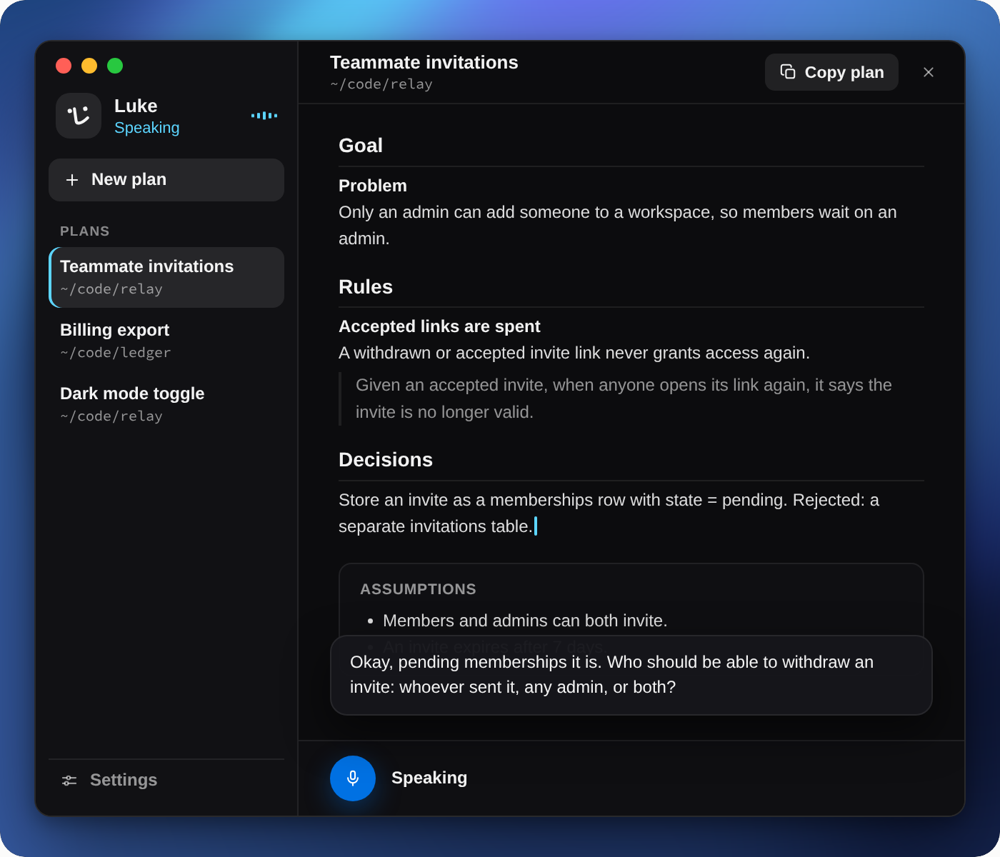

  <picture>
    <source media="(prefers-color-scheme: dark)" srcset="design/brand/luke-wordmark-dark.svg">
    
  </picture>

  
  
  
  

  <strong>Plan the feature before the agent writes it.</strong> 
  Talk through a feature with Luke before you give it to a coding agent.
  He reads the code while you talk and writes the plan down.

  <a href="https://github.com/ReviewStage/luke/releases/latest/download/Luke.dmg"><picture><source media="(prefers-color-scheme: dark)" srcset="design/brand/button/luke-cta-download-dark.svg"></picture></a>

  <a href="https://tryluke.dev">Website</a> ·
  <a href="PRIVACY.md">Privacy</a> ·
  <a href="CHANGELOG.md">Changelog</a> ·
  <a href="mailto:founders@stagereview.app">Contact</a>

## Why

A coding agent builds what you ask for. Usually what you ask for is one
sentence, and the agent guesses the rest. Some of those guesses are wrong, and
you find them in review.

Luke is for the talk before that. You describe the feature out loud, he reads
the code, and he asks about the parts you left open. He'll say so when he
thinks you're wrong. You're done when the plan is specific enough that the
agent doesn't have to guess.

## How a plan goes

Open Luke and press **New plan**. Give it a name and point it at the folder
your project lives in.

Press the microphone and say what you want. Something like "members should be
able to invite a teammate by email" is enough to start. Luke looks through the
folder while you talk, so his first question is usually about your code
rather than a checklist. He'll come back with an opinion: "You already have a
`memberships` table. I'd add a pending state there instead of a new table.
Does that work?" Say yes, or tell him why not.

Nobody has to take notes. A second model listens to the call and writes the
plan as you go, and you can watch it fill in. When you're done,
press **Copy** and paste the plan into Claude Code, Codex, or whatever you
use.

## What's in a plan

Every plan uses the same template:

| Section | What goes there |
| --- | --- |
| Goal | The problem today and what should be true after |
| Scope | What's in, what's out, and the constraints |
| Rules | One sentence per rule, each with Given/When/Then examples |
| Implementation | Files that change, new types and signatures, code to follow |
| Decisions | What was chosen, why, and what was turned down |
| Verification | How to check the whole thing works end to end |
| Left to the agent | The calls the agent is allowed to make on its own |
| Open questions | Anything still unresolved |
| Assumptions | Every guess Luke made that you didn't spell out |

Read the Assumptions list before you hand the plan off. When Luke suggests
a default and you say "sure", it goes there, so you can find the things you
agreed to without much thought.

The fields borrow from GitHub's
[Spec Kit](https://github.com/github/spec-kit), OpenAI's
[ExecPlans](https://developers.openai.com/cookbook/articles/codex_exec_plans),
and [Example Mapping](https://cucumber.io/blog/bdd/example-mapping-introduction/).

## How Luke reads your code

Luke doesn't upload your repository. When the planning model wants to see a
file, your Mac runs a read-only command such as `ls`, `grep`, or `cat` in the
plan's folder. The command runs in a macOS sandbox with no network and no
write access, and it can't read `.env` files. Only the command's output goes
to Luke's service. [PRIVACY.md](PRIVACY.md) has the details.

## Watching agent sessions

Luke started out as a voice that kept an eye on your running agents and
spoke up when one needed you. That part is switched off in the current build
while we work on planning. The code is still here, and it supports these
agents:

<!-- provider-agents:start -->
| Agent | Local | Cloud |
| --- | :---: | :---: |
| Claude Code | ✅ |  |
| Codex | ✅ |  |
| Conductor |  | ✅ |
| OMP | ✅ |  |
<!-- provider-agents:end -->

## Install

Luke runs on Apple silicon Macs with macOS 14 or newer.

1. [Download Luke](https://github.com/ReviewStage/luke/releases/latest/download/Luke.dmg).
2. Open the DMG and drag **Luke** into **Applications**.
3. Launch Luke and sign in with Google or GitHub.
4. Press **New plan**.

Luke asks for the microphone the first time you start a call. Voice,
keyboard shortcuts, and appearance are in **Settings**.

## Privacy

See [PRIVACY.md](PRIVACY.md).

## Contributing

Issues and pull requests are welcome. See [CONTRIBUTING.md](CONTRIBUTING.md)
to get set up, and [SECURITY.md](SECURITY.md) for reporting a vulnerability.

## Built by

[Charles Pan](https://x.com/ceefryingpan) and
[Dean Stratakos](https://x.com/DeanStratakos).

## License

Luke is licensed under the [Apache License 2.0](LICENSE).
